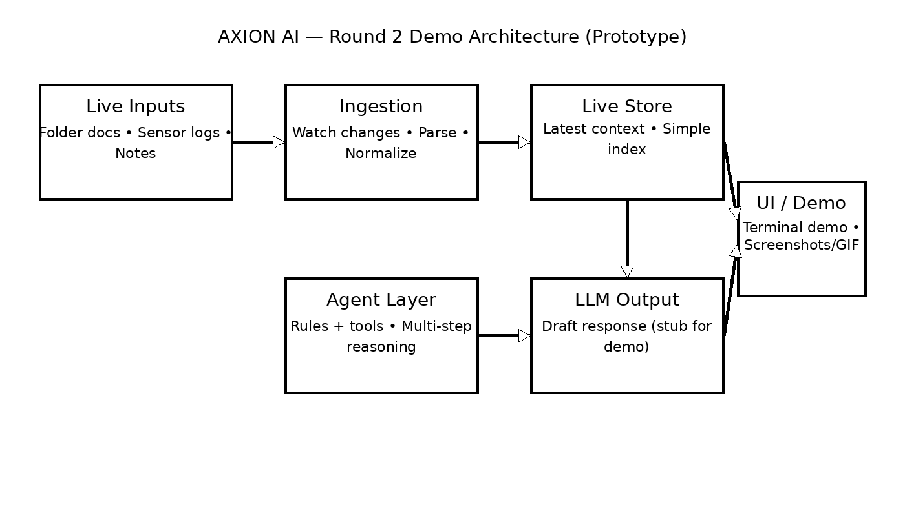

# AXION AI — Live Agentic AI System (Prototype)

## Overview
AXION AI is a **prototype agentic AI system** designed to reason over **live, continuously changing data** rather than static knowledge bases.

The project demonstrates how an agent-style architecture with streaming ingestion can avoid stale knowledge and adapt instantly to new inputs. AXION AI is developed as part of the **Synaptix Frontier AI Hack @ IIT Madras**.

---

## Problem Statement
Most AI systems today rely on static pipelines such as pre-indexed documents or batch-based Retrieval-Augmented Generation (RAG). Once indexed, their knowledge becomes outdated.

In real-world domains such as healthcare, research, and decision support, information changes continuously. Static AI systems fail to react to these changes in real time, leading to delayed or incorrect insights.

---

## Proposed Solution
AXION AI addresses this limitation by introducing a **live, agentic AI pipeline** that:

- Continuously ingests changing data
- Maintains an always-updated internal state
- Reasons over the latest information using an agent layer
- Produces adaptive outputs without re-indexing or restarting

The system is designed to demonstrate **real-time adaptation** rather than static query answering.

---

## System Architecture
<p align="center">
  
</p>

**High-level flow:**

Live Inputs → Ingestion Layer → Live Knowledge Store → Agent Reasoning → Output

The architecture separates ingestion, reasoning, and output layers to allow incremental updates and agent-based decision-making.

---

## Hardware Prototype (Demo Source)
AXION AI includes an **early hardware prototype** that acts as a **real-world data source** for the system.

The prototype:
- Generates live sensor data
- Acts as a physical interface for system integration
- Demonstrates feasibility of real-time data ingestion

> ⚠️ Note: The hardware shown is a prototype and not a finalized or certified medical device.

<p align="center">
  
</p>

---

## Live Demo
The demo below illustrates **live system behavior**.

When data inside the monitored folder is added or modified, AXION AI immediately reflects the changes in its responses without restarting or re-indexing the system.

<p align="center">
  
</p>

This demonstrates the core concept of **avoiding stale knowledge**.

---

## Setup Instructions
```bash
git clone https://github.com/yourusername/axion-ai
cd axion-ai
pip install -r requirements.txt
python src/demo.py
